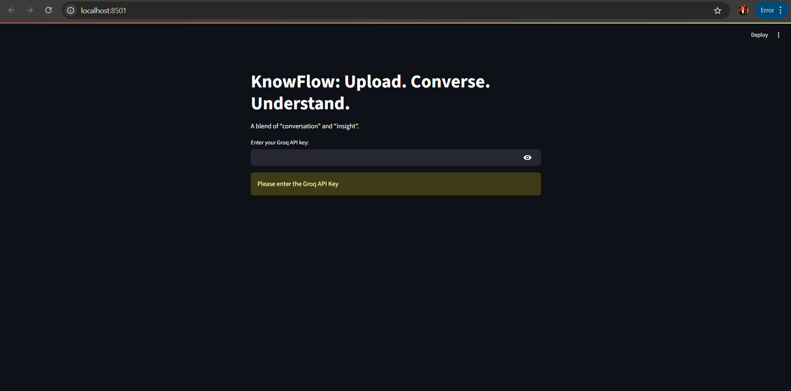
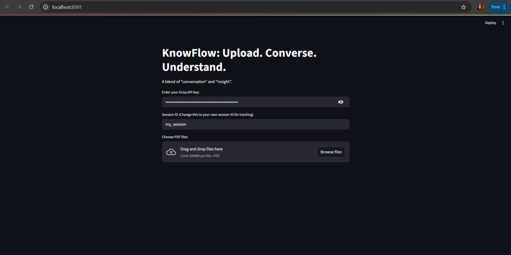
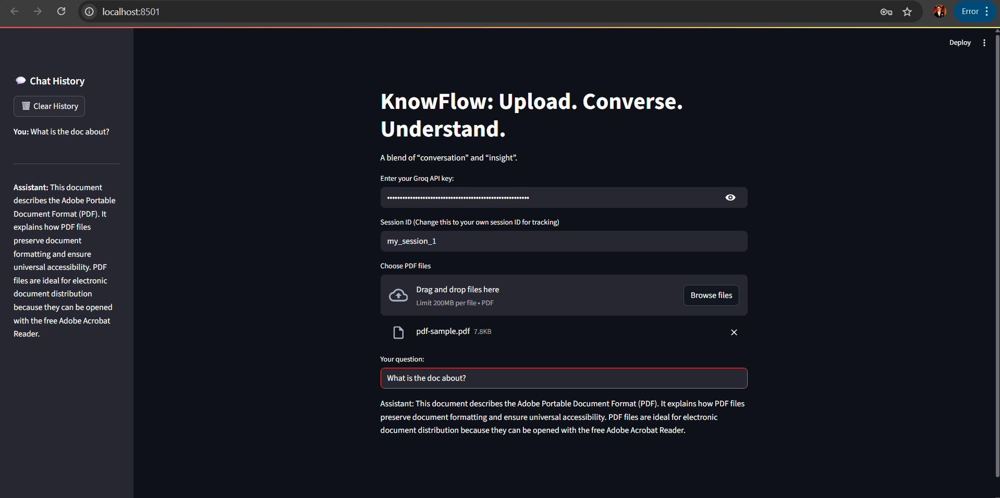
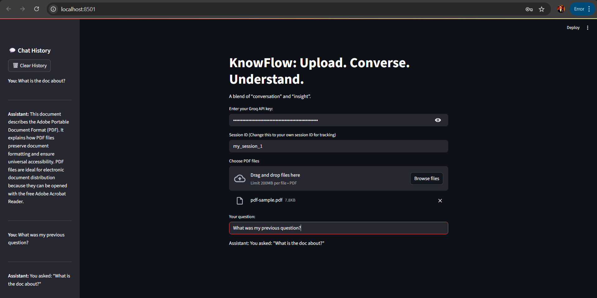
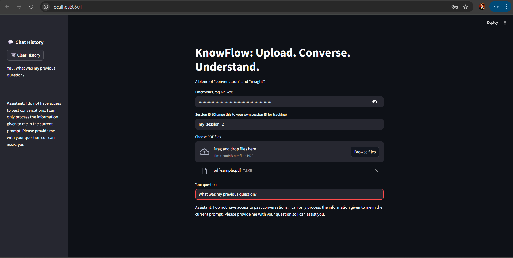

# RAG based Chatbot with Document Upload and Chat History

A modular, conversational RAG (Retrieval-Augmented Generation) system built with Streamlit that allows users to upload PDF documents and have interactive conversations about their content.

## Features

- **PDF Document Processing**: Upload and process multiple PDF files
- **Conversational AI**: Chat with document content using natural language
- **Session Management**: Maintain conversation history across sessions
- **Modular Architecture**: Clean, maintainable code structure
- **Vector Search**: Efficient document retrieval using embeddings
- **Groq Integration**: Fast LLM responses using Groq's API

## Project Structure

```
Mod_Custom_RAG_CH_FU_2127/
├── main.py                 # Main entry point
├── requirements.txt        # Python dependencies
├── README.md              # Project documentation
├── config/
│   ├── __init__.py
│   └── settings.py        # Configuration and constants
├── src/
│   ├── __init__.py
│   ├── app.py             # Main application orchestrator
│   ├── document_processor.py  # PDF processing and vectorization
│   ├── rag_chain.py       # RAG pipeline and conversational chains
│   ├── session_manager.py # Chat history and session management
│   └── ui_components.py   # Streamlit UI components
└── utils/                 # Utility functions (future use)
```

## Installation

1. **Clone or navigate to the project directory**:
   ```bash
   cd Mod_Custom_RAG_CH_FU_2127
   ```

2. **Install dependencies**:
   ```bash
   pip install -r requirements.txt
   ```

3. **Set up environment variables** (optional):
   Create a `.env` file in the project root with:
   ```
   HF_TOKEN=your_huggingface_token
   GROQ_API_KEY=your_groq_api_key
   ```

## Usage

1. **Run the application**:
   ```bash
   streamlit run main.py
   ```

2. **Access the web interface**:
   - Open your browser to the URL shown in the terminal (usually `http://localhost:8501`)

3. **Use the application**:
   - Enter your Groq API key
   - Upload one or more PDF files
   - Start chatting with the document content!

## Configuration

The application can be configured by modifying `config/settings.py`:

- **Model Settings**: Change embedding and LLM models
- **Text Processing**: Adjust chunk size and overlap
- **System Prompts**: Customize AI behavior
- **File Paths**: Modify temporary file locations

## Architecture

### Components

1. **DocumentProcessor**: Handles PDF loading, text splitting, and vectorization
2. **RAGChain**: Manages the RAG pipeline with history-aware retrieval
3. **SessionManager**: Maintains chat history and session state
4. **UIComponents**: Provides Streamlit interface elements
5. **RAGApplication**: Orchestrates all components

### Data Flow

1. User uploads PDF files
2. Documents are processed and vectorized
3. User asks questions
4. System retrieves relevant document chunks
5. LLM generates contextual responses
6. Chat history is maintained for conversation continuity

## Dependencies

- **Streamlit**: Web interface framework
- **LangChain**: RAG pipeline and LLM integration
- **Chroma**: Vector database for document storage
- **HuggingFace**: Embeddings and model hosting
- **Groq**: Fast LLM inference
- **PyPDF**: PDF document processing

## App Images











## Contributing

1. Fork the repository
2. Create a feature branch
3. Make your changes
4. Add tests if applicable
5. Submit a pull request

## License

This project is open source and available under the MIT License.

## Support

For issues and questions, please open an issue in the repository. 